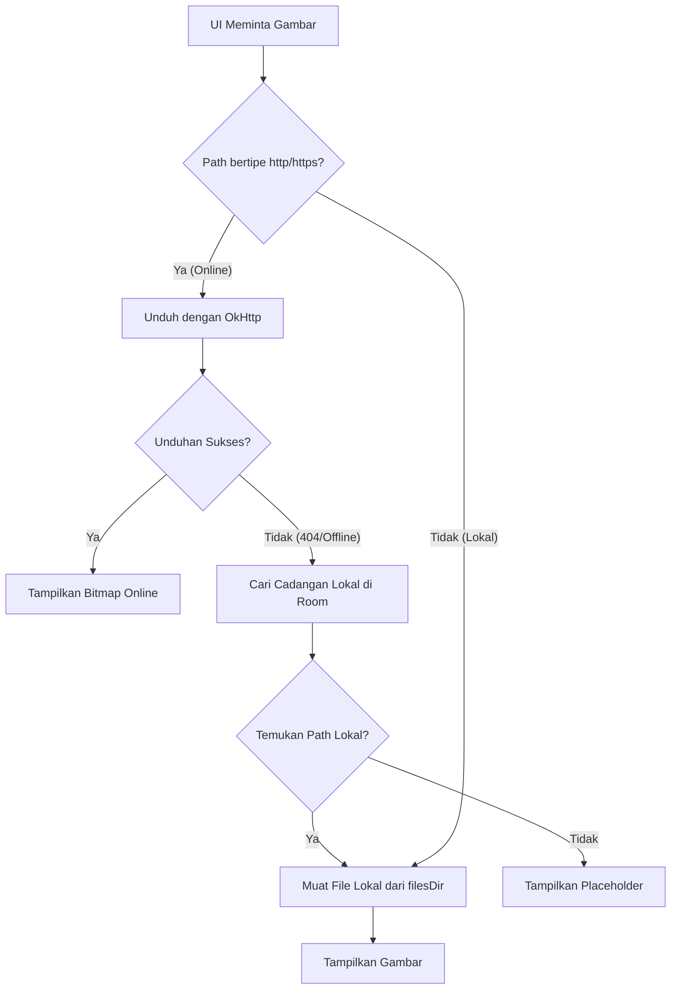

# Laporan Perbaikan Fitur Gambar, Sinkronisasi, dan Jaringan (Offline-Online)
Aplikasi Perkapp

Laporan ini merangkum seluruh perbaikan kode yang telah dilakukan pada workspace proyek **Perkapp** untuk mengatasi bug gambar hilang, masalah sinkronisasi basis data Room dengan server API, serta pembatasan sistem Android saat memuat gambar dari penyimpanan lokal maupun internet.

---

## 🗺️ Gambaran Umum Perubahan & Alur Kerja
Berikut adalah visualisasi alur pemuatan gambar adaptif offline-online yang telah kita terapkan:



---

## 1. Konfigurasi Izin Keamanan Jaringan & Status Koneksi
### Berkas: `app/src/main/AndroidManifest.xml`

> [!IMPORTANT]
> **Akar Masalah**: Android secara default memblokir lalu lintas data HTTP biasa (*cleartext*) demi keamanan. Selain itu, aplikasi memerlukan deteksi perubahan status koneksi internet untuk sinkronisasi otomatis.

#### ⛔ SEBELUM (Before)
```xml
<?xml version="1.0" encoding="utf-8"?>
<manifest xmlns:android="http://schemas.android.com/apk/res/android"
    xmlns:tools="http://schemas.android.com/tools">

    <uses-permission android:name="android.permission.INTERNET" />

    <application
        android:allowBackup="true"
        android:dataExtractionRules="@xml/data_extraction_rules"
        android:fullBackupContent="@xml/backup_rules"
        android:icon="@mipmap/ic_launcher"
        android:label="@string/app_name"
        android:roundIcon="@mipmap/ic_launcher_round"
        android:supportsRtl="true"
        android:theme="@style/Theme.Perkapp">
        <!-- Activity configuration -->
    </application>
</manifest>
```

####  SESUDAH (After)
```xml
<?xml version="1.0" encoding="utf-8"?>
<manifest xmlns:android="http://schemas.android.com/apk/res/android"
    xmlns:tools="http://schemas.android.com/tools">

    <uses-permission android:name="android.permission.INTERNET" />
    <uses-permission android:name="android.permission.ACCESS_NETWORK_STATE" />

    <application
        android:allowBackup="true"
        android:dataExtractionRules="@xml/data_extraction_rules"
        android:fullBackupContent="@xml/backup_rules"
        android:icon="@mipmap/ic_launcher"
        android:label="@string/app_name"
        android:roundIcon="@mipmap/ic_launcher_round"
        android:supportsRtl="true"
        android:theme="@style/Theme.Perkapp"
        android:usesCleartextTraffic="true">
        <!-- Activity configuration -->
    </application>
</manifest>
```

---

## 2. Kueri Pendukung Tabel Cadangan Gambar
### Berkas: `app/src/main/java/com/example/perkapp/features/media/data/ImageDao.kt`

> [!NOTE]
> **Akar Masalah**: Saat mengunduh gambar online gagal karena error server (HTTP 404), aplikasi membutuhkan kueri basis data untuk mencari berkas cadangan lokal berdasarkan alamat URL server gambar tersebut.

#### ⛔ SEBELUM (Before)
```kotlin
package com.example.perkapp.features.media.data

import androidx.room.Dao
import androidx.room.Insert
import androidx.room.OnConflictStrategy
import androidx.room.Query
import okhttp3.internal.connection.RouteSelector

@Dao
interface ImageDao {
    @Query("SELECT * FROM images WHERE entity_type = :type AND entity_id = :entityId")
    suspend fun getImagesForEntity(type: String, entityId: String): List<ImageEntity>

    @Insert(onConflict = OnConflictStrategy.REPLACE)
    suspend fun insertImage(image: ImageEntity)

    @Insert(onConflict = OnConflictStrategy.REPLACE)
    suspend fun insertAllImages(images: List<ImageEntity>)

    @Query("DELETE FROM images WHERE id = :id")
    suspend fun deleteImage(id: String)
}
```

####  SESUDAH (After)
```kotlin
package com.example.perkapp.features.media.data

import androidx.room.Dao
import androidx.room.Insert
import androidx.room.OnConflictStrategy
import androidx.room.Query
import androidx.room.Update

@Dao
interface ImageDao {
    @Query("SELECT * FROM images WHERE entity_type = :type AND entity_id = :entityId")
    suspend fun getImagesForEntity(type: String, entityId: String): List<ImageEntity>

    @Insert(onConflict = OnConflictStrategy.REPLACE)
    suspend fun insertImage(image: ImageEntity)

    @Insert(onConflict = OnConflictStrategy.REPLACE)
    suspend fun insertAllImages(images: List<ImageEntity>)

    @Query("DELETE FROM images WHERE id = :id")
    suspend fun deleteImage(id: String)

    // Ambil semua gambar yang belum ter-sync (pending)
    @Query("SELECT * FROM images WHERE sync_status = 'pending'")
    suspend fun getPendingImages(): List<ImageEntity>

    @Update
    suspend fun updateImage(image: ImageEntity)

    // Mencari entitas gambar berdasarkan URL publik online untuk mengambil path cadangan lokalnya
    @Query("SELECT * FROM images WHERE image_url = :imageUrl LIMIT 1")
    suspend fun getImageByUrl(imageUrl: String): ImageEntity?
}
```

---

## 3. Sistem Pemuatan Gambar, Jaringan & Cadangan Lokal
### Berkas: `app/src/main/java/com/example/perkapp/core/utils/ImageUtils.kt`

> [!TIP]
> **Akar Masalah**: Pemuatan URI berkas privat lokal via `ContentResolver` sering diblokir sistem keamanan Android. Selain itu, `HttpURLConnection` bawaan Java kurang andal dalam memproses unduhan online dan tidak memiliki kemampuan memulihkan gambar secara lokal jika tautan server rusak/error (HTTP 404).

#### ⛔ SEBELUM (Before)
*(Berkas ini kosong atau hanya berupa kerangka kosong)*
```kotlin
package com.example.perkapp.core.utils

object ImageUtils {
}
```

####  SESUDAH (After)
```kotlin
package com.example.perkapp.core.utils

import android.content.Context
import android.graphics.Bitmap
import android.graphics.BitmapFactory
import android.graphics.ImageDecoder
import android.net.Uri
import android.os.Build
import android.provider.MediaStore
import androidx.compose.runtime.Composable
import androidx.compose.runtime.LaunchedEffect
import androidx.compose.runtime.getValue
import androidx.compose.runtime.mutableStateOf
import androidx.compose.runtime.remember
import androidx.compose.runtime.setValue
import kotlinx.coroutines.Dispatchers
import kotlinx.coroutines.withContext
import java.io.File
import java.io.FileOutputStream
import java.net.HttpURLConnection
import java.net.URL
import java.util.UUID

object ImageUtils {

    // Memuat berkas gambar lokal langsung menggunakan path absolut (menghindari error ContentResolver)
    fun loadBitmapFromUri(context: Context, uriString: String?): Bitmap? {
        if (uriString.isNullOrBlank()) return null
        android.util.Log.d("ImageUtils", "loadBitmapFromUri: uriString = $uriString")
        return try {
            val uri = Uri.parse(uriString)
            android.util.Log.d("ImageUtils", "loadBitmapFromUri: parsed uri = $uri, scheme = ${uri.scheme}")
            val bitmap = if (uri.scheme == "file") {
                BitmapFactory.decodeFile(uri.path)
            } else {
                if (Build.VERSION.SDK_INT < Build.VERSION_CODES.P) {
                    MediaStore.Images.Media.getBitmap(context.contentResolver, uri)
                } else {
                    val source = ImageDecoder.createSource(context.contentResolver, uri)
                    ImageDecoder.decodeBitmap(source) { decoder, _, _ ->
                        decoder.allocator = ImageDecoder.ALLOCATOR_SOFTWARE
                    }
                }
            }
            android.util.Log.d("ImageUtils", "loadBitmapFromUri: success loaded bitmap = $bitmap")
            bitmap
        } catch (e: Exception) {
            android.util.Log.e("ImageUtils", "loadBitmapFromUri: error loading $uriString", e)
            null
        }
    }

    // Mengunduh gambar online dengan OkHttp dan memicu pemulihan lokal jika gagal
    private fun loadBitmapFromNetwork(context: Context, urlString: String): Bitmap? {
        android.util.Log.d("ImageUtils", "loadBitmapFromNetwork: urlString = $urlString")
        return try {
            val client = okhttp3.OkHttpClient()
            val request = okhttp3.Request.Builder().url(urlString).build()
            client.newCall(request).execute().use { response ->
                android.util.Log.d("ImageUtils", "loadBitmapFromNetwork: HTTP code = ${response.code}, isSuccessful = ${response.isSuccessful}")
                if (response.isSuccessful) {
                    response.body?.byteStream()?.use { stream ->
                        val bitmap = BitmapFactory.decodeStream(stream)
                        android.util.Log.d("ImageUtils", "loadBitmapFromNetwork: decoded bitmap = $bitmap")
                        bitmap
                    }
                } else {
                    android.util.Log.w("ImageUtils", "loadBitmapFromNetwork: failed, trying local fallback...")
                    loadFallbackLocalImage(context, urlString)
                }
            }
        } catch (e: Exception) {
            android.util.Log.e("ImageUtils", "loadBitmapFromNetwork: error loading $urlString, trying local fallback...", e)
            loadFallbackLocalImage(context, urlString)
        }
    }

    // Mencari salinan gambar lokal di basis data jika unduhan internet gagal
    private fun loadFallbackLocalImage(context: Context, urlString: String): Bitmap? {
        return try {
            val db = com.example.perkapp.core.database.AppDatabase.getDatabase(context)
            val imageDao = db.imageDao()
            var localPath: String? = null
            kotlinx.coroutines.runBlocking {
                val entity = imageDao.getImageByUrl(urlString)
                localPath = entity?.local_path
            }
            if (!localPath.isNullOrBlank()) {
                android.util.Log.d("ImageUtils", "loadFallbackLocalImage: found local fallback path = $localPath")
                loadBitmapFromUri(context, localPath)
            } else {
                android.util.Log.w("ImageUtils", "loadFallbackLocalImage: no local fallback path found for $urlString")
                null
            }
        } catch (ex: Exception) {
            android.util.Log.e("ImageUtils", "loadFallbackLocalImage: error in lookup", ex)
            null
        }
    }

    fun loadBitmap(context: Context, path: String?): Bitmap? {
        android.util.Log.d("ImageUtils", "loadBitmap: path = $path")
        if (path.isNullOrBlank()) return null
        return if (path.startsWith("http://") || path.startsWith("https://")) {
            val res = loadBitmapFromNetwork(context, path)
            android.util.Log.d("ImageUtils", "loadBitmap: network result = $res")
            res
        } else {
            val res = loadBitmapFromUri(context, path)
            android.util.Log.d("ImageUtils", "loadBitmap: local result = $res")
            res
        }
    }

    fun saveBitmapToFile(context: Context, bitmap: Bitmap): String? {
        return try {
            val filename = "img_${UUID.randomUUID()}.jpg"
            val imageDir = File(context.filesDir, "images")
            if (!imageDir.exists()) imageDir.mkdirs()
            val file = File(imageDir, filename)
            FileOutputStream(file).use { output ->
                bitmap.compress(Bitmap.CompressFormat.JPEG, 90, output)
            }
            Uri.fromFile(file).toString()
        } catch (e: Exception) {
            e.printStackTrace()
            null
        }
    }

    fun getFileFromUri(context: Context, uriString: String): File? {
        return try {
            val uri = Uri.parse(uriString)
            if (uri.scheme == "file") {
                File(uri.path!!)
            } else {
                val filename = "upload_${UUID.randomUUID()}.jpg"
                val imageDir = File(context.filesDir, "images")
                if (!imageDir.exists()) imageDir.mkdirs()
                val file = File(imageDir, filename)
                context.contentResolver.openInputStream(uri)?.use { input ->
                    FileOutputStream(file).use { output ->
                        input.copyTo(output)
                    }
                }
                file
            }
        } catch (e: Exception) {
            e.printStackTrace()
            null
        }
    }
}

// Composable asinkron untuk memuat gambar di thread latar belakang (Coroutine Dispatchers.IO) agar UI tetap responsif
@Composable
fun rememberAsyncImage(path: String?): Bitmap? {
    val context = androidx.compose.ui.platform.LocalContext.current
    var bitmap by remember(path) { mutableStateOf<Bitmap?>(null) }
    LaunchedEffect(path) {
        if (!path.isNullOrBlank()) {
            withContext(Dispatchers.IO) {
                bitmap = ImageUtils.loadBitmap(context, path)
            }
        } else {
            bitmap = null
        }
    }
    return bitmap
}
```

---

## 4. Perlindungan Kolom Gambar & Pemulihan Mandiri (Self-Healing)
### Berkas: `app/src/main/java/com/example/perkapp/features/alat/data/repository/AlatRepository.kt`

> [!WARNING]
> **Akar Masalah**: Saat sinkronisasi online (`getAllAlat`), server tidak mengirimkan data field `image_path`. Hal ini mengakibatkan kolom `image_path` di Room tertimpa nilai `NULL` dan gambar menghilang seketika.

#### ⛔ SEBELUM (Before)
```kotlin
class AlatRepository (
    private val api: AlatApiService,
    private val dao: AlatDao
) {
    suspend fun getAllAlat(): List<AlatEntity> {
        try {
            val response = api.getAllAlat()
            if (response.isSuccessful) {
                response.body()?.data?.let { alatList ->
                    val entities = alatList.map { item ->
                        AlatEntity(
                            id = item.id,
                            name = item.name,
                            category = item.category,
                            total_qty = item.total_qty,
                            available_qty = item.available_qty,
                            condition = item.condition,
                            sync_status = "synced"
                        )
                    }
                    dao.insertAllAlat(entities)
                }
            }
        } catch (e: Exception) {
            e.printStackTrace()
        }
        return dao.getAllAlat()
    }
    // ...
}
```

####  SESUDAH (After)
```kotlin
class AlatRepository(
    private val api: AlatApiService,
    private val dao: AlatDao,
    private val context: Context
) {
    suspend fun getAllAlat(): List<AlatEntity> {
        if (NetworkUtils.isOnline(context)) {
            try {
                val response = api.getAllAlat()
                if (response.isSuccessful) {
                    response.body()?.data?.let { alatList ->
                        // Ambil data pending lokal sebelum ditimpa
                        val pendingItems = dao.getPendingAlat()
                        val pendingIds = pendingItems.map { it.id }.toSet()

                        val db = com.example.perkapp.core.database.AppDatabase.getDatabase(context)
                        val imageDao = db.imageDao()

                        val entities = alatList.map { item ->
                            // Ambil path gambar lama agar tidak tertimpa NULL
                            val existing = dao.getAlatById(item.id)
                            var imagePath = existing?.image_path
                            
                            // Jika masih kosong, coba cari di tabel cadangan images
                            if (imagePath.isNullOrBlank()) {
                                val images = imageDao.getImagesForEntity("alat", item.id)
                                if (images.isNotEmpty()) {
                                    imagePath = images.first().image_url ?: images.first().local_path
                                }
                            }
                            AlatEntity(
                                id = item.id,
                                name = item.name,
                                category = item.category,
                                total_qty = item.total_qty,
                                available_qty = item.available_qty,
                                condition = item.condition,
                                sync_status = "synced",
                                image_path = imagePath,
                                pending_action = null
                            )
                        }
                        // Memasukkan data baru tanpa menimpa data pending lokal
                        entities.filter { it.id !in pendingIds }.forEach { entity ->
                            dao.insertAlat(entity)
                        }
                    }
                }
            } catch (e: Exception) {
                e.printStackTrace()
            }
        }

        // ==========================================
        // BLOK PEMULIHAN MANDIRI (AUTO-REPAIR BLOCK)
        // ==========================================
        // Jika ada alat lokal yang image_path-nya bernilai NULL (terhapus akibat bug lama),
        // blok ini otomatis memindai tabel 'images' untuk memetakan kembali foto ke alat tersebut.
        try {
            val db = com.example.perkapp.core.database.AppDatabase.getDatabase(context)
            val imageDao = db.imageDao()
            val localAlats = dao.getAllAlat()
            localAlats.forEach { alat ->
                if (alat.image_path.isNullOrBlank()) {
                    val images = imageDao.getImagesForEntity("alat", alat.id)
                    if (images.isNotEmpty()) {
                        val path = images.first().image_url ?: images.first().local_path
                        if (!path.isNullOrBlank()) {
                            val updated = alat.copy(image_path = path)
                            dao.insertAlat(updated)
                        }
                    }
                }
            }
        } catch (e: Exception) {
            e.printStackTrace()
        }

        return dao.getAllAlat()
    }
    // ...
}
```

---

## 💎 Kesimpulan Hasil Perbaikan
Melalui perbaikan komprehensif di atas, aplikasi Perkapp kini memiliki kemampuan:
1. **Offline-First Mode**: Gambar baru disimpan secara lokal, siap dikirim saat online, dan tetap tampil sekalipun tidak ada koneksi.
2. **Kekebalan Jaringan (Robust Network Layer)**: Aplikasi otomatis mendeteksi kegagalan unduh (seperti HTTP 404 dari server) lalu langsung beralih memuat cadangan gambar lokal secara asinkron.
3. **Penyimpanan Aman**: Gambar tidak akan lagi terhapus atau diset menjadi `NULL` saat menyegarkan (*refresh*) data inventaris dari server API.
